# EAP-TLS — macOS avec Microsoft Intune + Aruba Central NAC

> 🇫🇷 Français | 🇬🇧 [English](README.md)


---

## Table des matières

- [Présentation](#présentation)
- [Prérequis](#prérequis)
- [Partie 1 — Profils de configuration Intune](#partie-1--profils-de-configuration-intune)
  - [1.1 Trusted Certificate](#11-trusted-certificate)
  - [1.2 SCEP Certificate](#12-scep-certificate)
  - [1.3 Wi-Fi](#13-wi-fi)
- [Partie 2 — Enrôlement macOS via Company Portal](#partie-2--enrôlement-macos-via-company-portal)
  - [2.1 Installer Company Portal](#21-installer-company-portal)
  - [2.2 Se connecter et enrôler](#22-se-connecter-et-enrôler)
  - [2.3 Installer le profil de gestion](#23-installer-le-profil-de-gestion)
  - [2.4 Finaliser l'enrôlement](#24-finaliser-lenrôlement)
- [Partie 3 — Validation](#partie-3--validation)
- [Références](#références)

---

## Présentation

Ce guide couvre la partie **Microsoft Intune** de la configuration EAP-TLS pour macOS — profils Intune (Trusted Certificate, SCEP, Wi-Fi) et enrôlement via Company Portal.

```
Endpoint macOS (géré par Intune)
    │
    │  Certificat SCEP délivré par le CA Central NAC
    ▼
Aruba AP (802.1X EAP-TLS)
    │
    │  Authentification RADIUS
    ▼
Aruba Central NAC
    │
    │  Vérification de conformité via OAuth2
    ▼
Microsoft Intune / Entra ID
    │
    ▼
Accès réseau accordé (rôle assigné par la politique NAC)
```

> [!NOTE]
> Ce guide couvre uniquement la configuration Intune. Pour les prérequis uniques (App Registration Entra ID + certificat Apple APNs), voir [../prerequisites/README-fr.md](../prerequisites/README-fr.md). Pour la configuration Aruba Central NAC, voir [hpe-aruba-guides / central-nac-intune](https://github.com/Luconik/hpe-aruba-guides/tree/main/central-nac-intune).

---

## Prérequis

- Prérequis uniques complétés — voir [../prerequisites/README-fr.md](../prerequisites/README-fr.md)
  - App Registration Entra ID configurée
  - **Certificat Apple MDM Push (APNs)** configuré dans Intune
- Aruba Central NAC configuré — voir [hpe-aruba-guides / central-nac-intune](https://github.com/Luconik/hpe-aruba-guides/tree/main/central-nac-intune)
- URL SCEP et certificat CA racine récupérés depuis Central NAC
- macOS 14 Sonoma ou version ultérieure
- Application Microsoft **Company Portal** installée sur l'appareil

---

## Partie 1 — Profils de configuration Intune

Trois profils doivent être créés dans Intune **dans cet ordre** :

| # | Type de profil | Nom | Rôle |
|---|---|---|---|
| 1 | Trusted Certificate | `Luconik Trusted - macOS` | Déployer le CA racine de Central NAC sur l'appareil |
| 2 | SCEP Certificate | `Luconik SCEP - macOS` | Demander un certificat client auprès de Central NAC |
| 3 | Wi-Fi | `Luconik Wi-Fi - macOS` | Configurer le 802.1X EAP-TLS sur le SSID |

> [!IMPORTANT]
> Toujours créer les profils dans cet ordre. Le profil SCEP dépend du profil Trusted Certificate, et le profil Wi-Fi dépend des deux.

---

### 1.1 Trusted Certificate

Naviguer vers :
```
Intune Admin Center → Appareils → macOS → Configuration → + Créer → Modèles → Trusted certificate
```

<p align="center"></p>

**Basics** — nom : `Luconik Trusted - macOS`.

<p align="center"></p>

**Paramètres de configuration** — uploader le certificat CA racine (`.cer`) téléchargé depuis Central NAC. Définir **Deployment Channel** sur `Device Channel`.

<p align="center"></p>

**Affectations** — affecter à **Tous les appareils** et **Tous les utilisateurs**.

<p align="center"></p>

**Vérifier + créer** — vérifier le résumé puis cliquer sur **Créer**.

<p align="center"></p>

<p align="center"></p>

---

### 1.2 SCEP Certificate

Naviguer vers :
```
Intune Admin Center → Appareils → macOS → Configuration → + Créer → Modèles → SCEP certificate
```

<p align="center"></p>

**Basics** — nom : `Luconik SCEP - macOS`.

<p align="center"></p>

**Paramètres de configuration**

| Paramètre | Valeur |
|---|---|
| Deployment Channel | `Device Channel` |
| Type de certificat | `User` |
| Format du nom de l'objet | `CN={{UserPrincipalName}}` |
| Autre nom de l'objet | `User principal name (UPN)` → `{{UserPrincipalName}}` |
| Période de validité | `1 Ans` |
| Utilisation de la clé | `Digital signature` |
| Taille de la clé (bits) | `2048` |
| Certificat racine | `Luconik Trusted - macOS` |
| Utilisation étendue de la clé | `Client Authentication` — `1.3.6.1.5.5.7.3.2` |
| Seuil de renouvellement (%) | `20` |
| URL du serveur SCEP | URL SCEP de Central NAC |

<p align="center"></p>

<p align="center"></p>

**Vérifier + créer**

<p align="center"></p>

<p align="center"></p>

**Affectations** — affecter à **Tous les appareils** et **Tous les utilisateurs**.

<p align="center"></p>

---

### 1.3 Wi-Fi

Naviguer vers :
```
Intune Admin Center → Appareils → macOS → Configuration → + Créer → Modèles → Wi-Fi
```

<p align="center"></p>

**Basics** — nom : `Luconik Wi-Fi - macOS`.

<p align="center"></p>

**Paramètres de configuration**

| Paramètre | Valeur |
|---|---|
| SSID | `luconik-corp` |
| Se connecter automatiquement | `Activer` |
| Réseau masqué | `Désactiver` |
| Type EAP | `EAP - TLS` |
| Noms des serveurs de certificats | `luconik-corp` |
| Certificats racines pour la validation | `Luconik Trusted - macOS` |
| Méthode d'authentification | `Certificats` |
| Certificat client | `Luconik SCEP - macOS` |

<p align="center"></p>

**Vérifier + créer**

<p align="center"></p>

**Affectations** — affecter à **Tous les appareils** et **Tous les utilisateurs**.

<p align="center"></p>

---

## Partie 2 — Enrôlement macOS via Company Portal

### 2.1 Installer Company Portal

Télécharger le `.pkg` Company Portal depuis Microsoft :

```
https://go.microsoft.com/fwlink/?linkid=853070
```

<p align="center"></p>

Lancer l'installeur et suivre l'assistant — Introduction → Licence → Type d'installation → Authentification Touch ID ou mot de passe → Succès → Corbeille.

<p align="center"></p>
<p align="center"></p>
<p align="center"></p>
<p align="center"></p>
<p align="center"></p>
<p align="center"></p>
<p align="center"></p>

---

### 2.2 Se connecter et enrôler

Ouvrir **Company Portal** et se connecter avec le compte d'entreprise Entra ID.

<p align="center">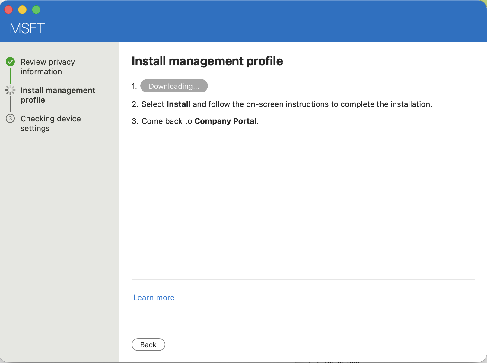</p>

Cliquer sur **Commencer** pour démarrer l'enrôlement.

<p align="center">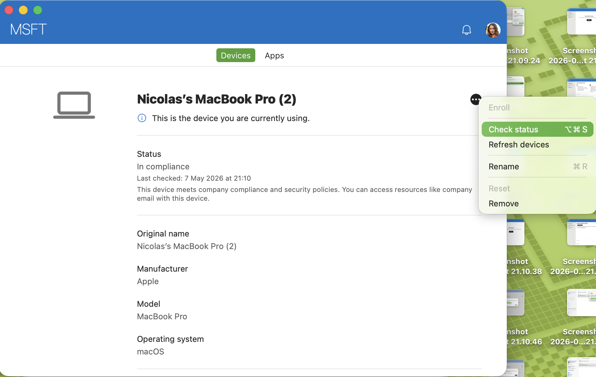</p>

Consulter les informations de confidentialité.

<p align="center">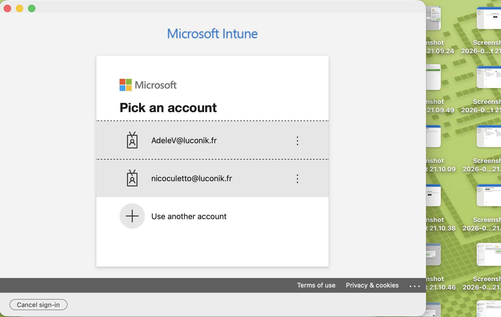</p>

---

### 2.3 Installer le profil de gestion

Cliquer sur **Télécharger le profil** dans Company Portal.

<p align="center">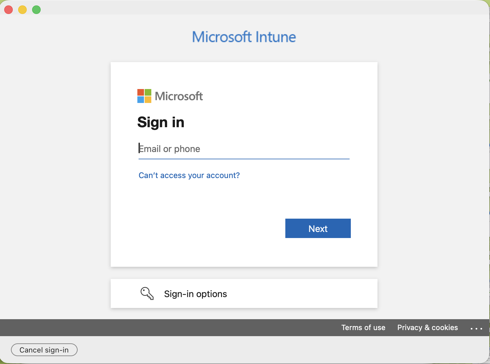</p>

macOS ouvre automatiquement **Réglages Système → Général → Gestion des appareils**.

<p align="center">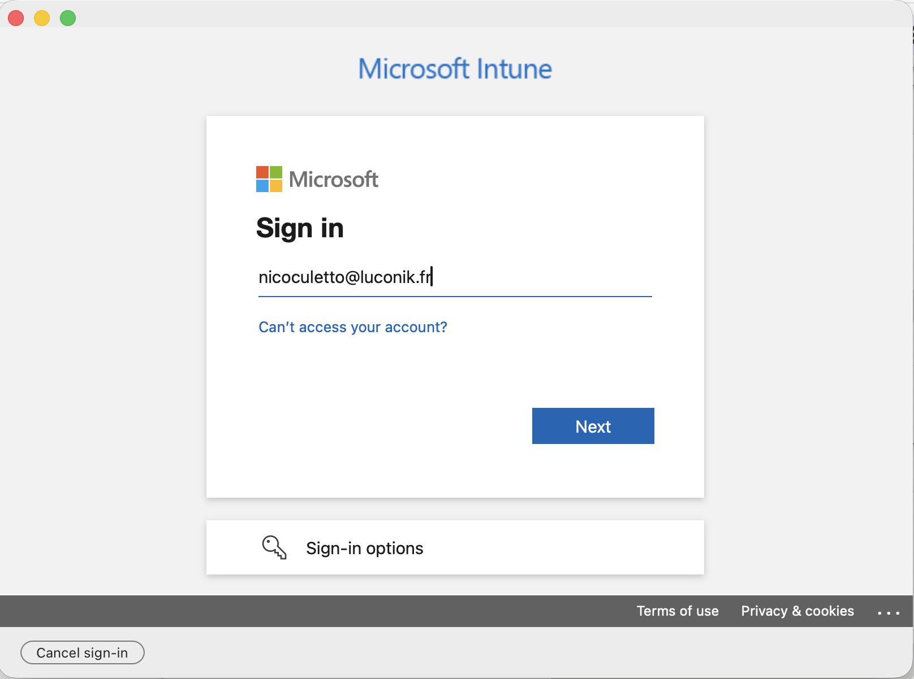</p>

Le profil apparaît comme **Non installé** — cliquer pour consulter, puis cliquer sur **Installer**.

<p align="center">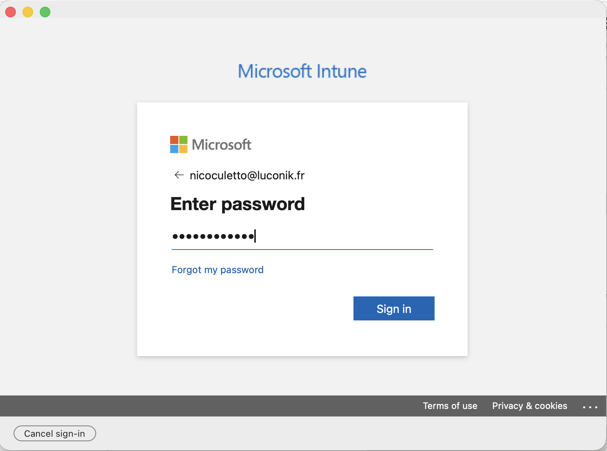</p>

<p align="center">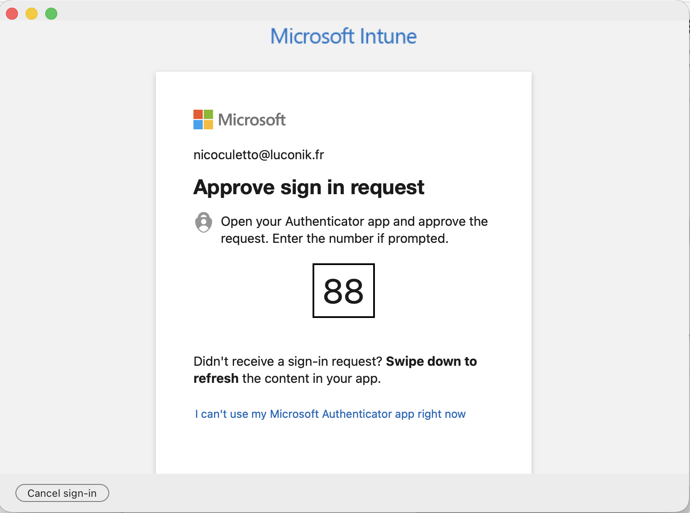</p>

Saisir le mot de passe de l'utilisateur macOS pour autoriser l'enrôlement MDM.

<p align="center">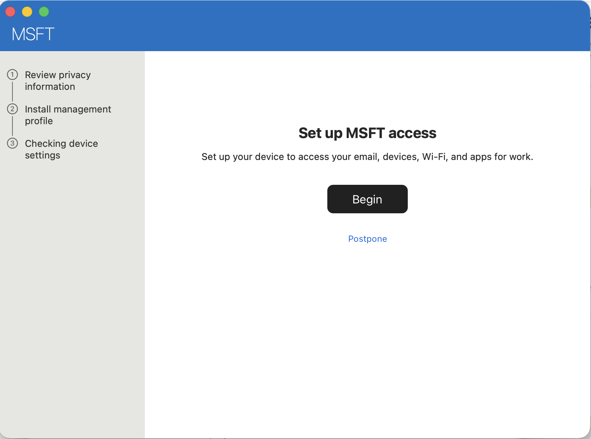</p>

Le profil est installé — le Mac est maintenant **géré par MSFT**.

<p align="center">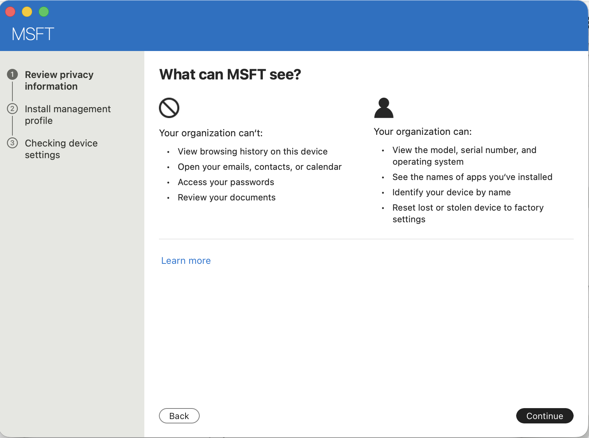</p>

---

### 2.4 Finaliser l'enrôlement

Retourner dans Company Portal — le téléchargement du profil se finalise automatiquement.

<p align="center">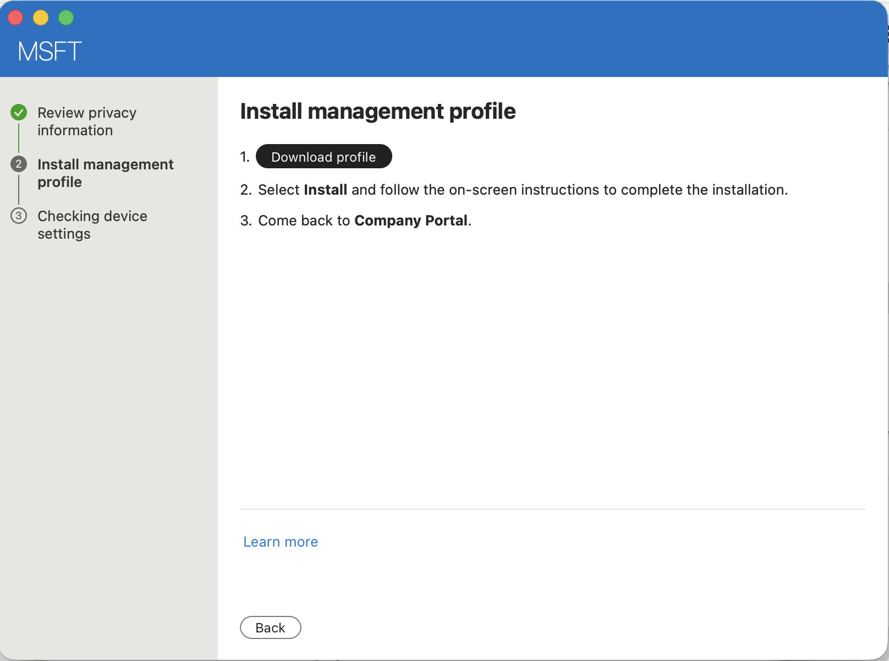</p>

<p align="center">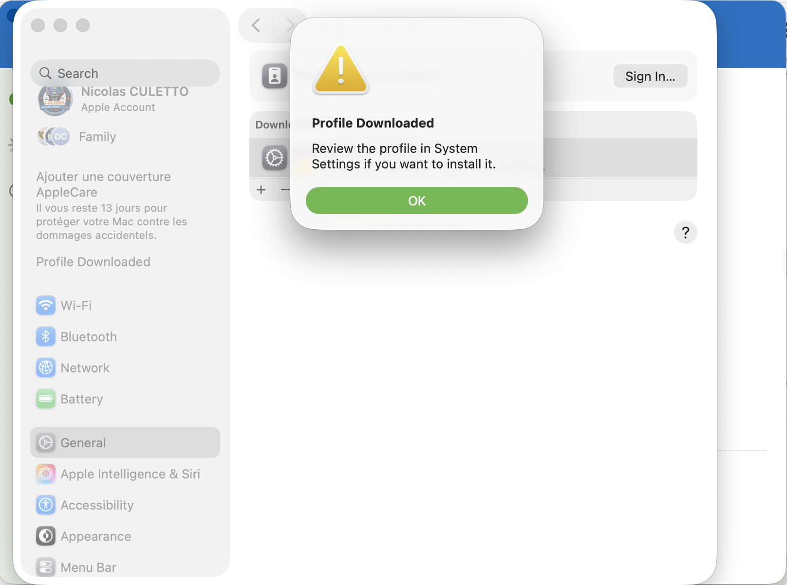</p>

Sélectionner la catégorie d'appareil : `RootCA-Installed`.

<p align="center">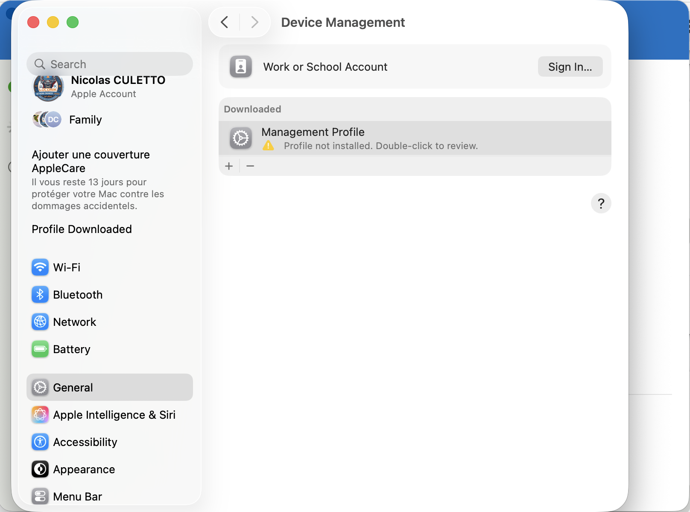</p>

<p align="center">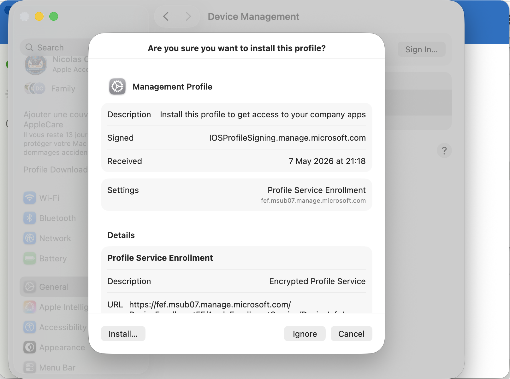</p>

---

## Partie 3 — Validation

### 3.1 Certificats dans Trousseau d'accès

Ouvrir **Trousseau d'accès** → trousseau **Système** — le certificat Intune MDM Device doit être présent.

<p align="center"></p>

Dans le trousseau **login**, vérifier :

| Certificat | Statut attendu |
|---|---|
| `Cloud Authentication Private Root CA (powered by HPE Aruba)` | De confiance |
| `Cloud Authentication SCEP RA (powered by HPE Aruba)` | Présent |
| `<utilisateur@domaine>` | Certificat client ×2 (émis par SCEP) |

<p align="center"></p>

---

### 3.2 Profils dans Réglages Système

Naviguer vers :
```
Réglages Système → Général → Gestion des appareils
```

Trois profils doivent apparaître sous **Utilisateur (géré)** :

| Profil | Type |
|---|---|
| Credential Profile | Trusted Certificate |
| SCEP Profile | SCEP Certificate |
| WiFi Profile | Wi-Fi |

<p align="center"></p>

---

### 3.3 Connexion Wi-Fi

Le SSID `luconik-corp` doit être connecté avec la sécurité **WPA2 Enterprise**.

<p align="center"></p>

---

### 3.4 Aruba Central NAC

> [!NOTE]
> Les captures de validation Central NAC sont dans le dépôt [hpe-aruba-guides / central-nac-intune / macos](https://github.com/Luconik/hpe-aruba-guides/tree/main/central-nac-intune/macos/screenshots).

L'utilisateur enrôlé doit apparaître comme **Accepted** dans Central NAC → Monitoring → Clients, avec :

| Champ | Valeur attendue |
|---|---|
| Statut | Accepted |
| Type d'authentification | EAP-TLS (Certificate) |
| Statut du certificat | Valide |
| Identity Store | Luconik_EntraID |
| Vendor / Model/OS | Apple / Mac OS |

---

### 3.5 Intune Admin Center

Naviguer vers :
```
Intune Admin Center → Appareils → Appareils macOS
```

L'appareil doit être **Conforme** et les trois profils de configuration doivent afficher **Réussi**.

<p align="center"></p>

<p align="center"></p>

<p align="center"></p>

---

## Références

- 📘 [Aruba Central NAC — UEM Onboarding with Intune](https://arubanetworking.hpe.com/techdocs/NAC/central-nac/central-nac-uem-onboarding-intune/)
- [Microsoft Intune — Profils de certificat SCEP](https://learn.microsoft.com/fr-fr/mem/intune/protect/certificates-scep-configure)
- [Microsoft Intune — Enrôlement macOS](https://learn.microsoft.com/fr-fr/mem/intune/enrollment/macos-enroll)
- [Portail Apple Push Certificates](https://identity.apple.com/pushcert/)

---

## Structure des fichiers

```
eap-tls/macos/
├── README.md               ← Version anglaise
├── README-fr.md            ← Ce fichier (FR)
└── screenshots/
    ├── 81-intune-macos-trusted-profile-select.png
    ├── ...
    ├── 130-intune-macos-profiles-list.png
    └── fr/
        ├── 107-macos-cp-signin-fr.png
        └── ...
```

---

*Dernière mise à jour : Mai 2026 — [@Luconik](https://github.com/Luconik)*
