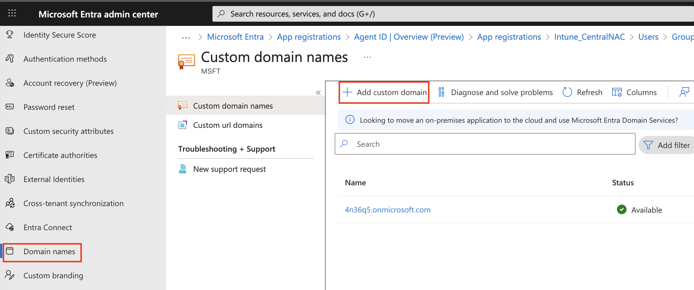
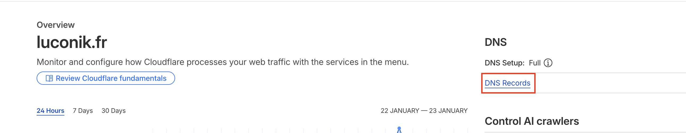
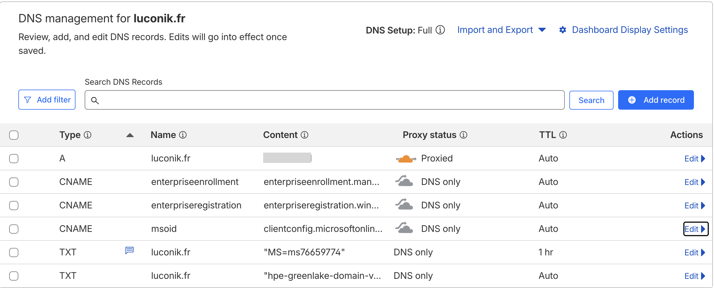
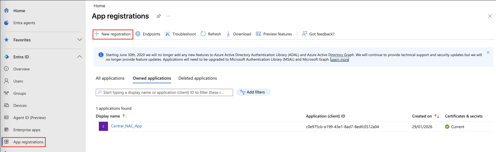
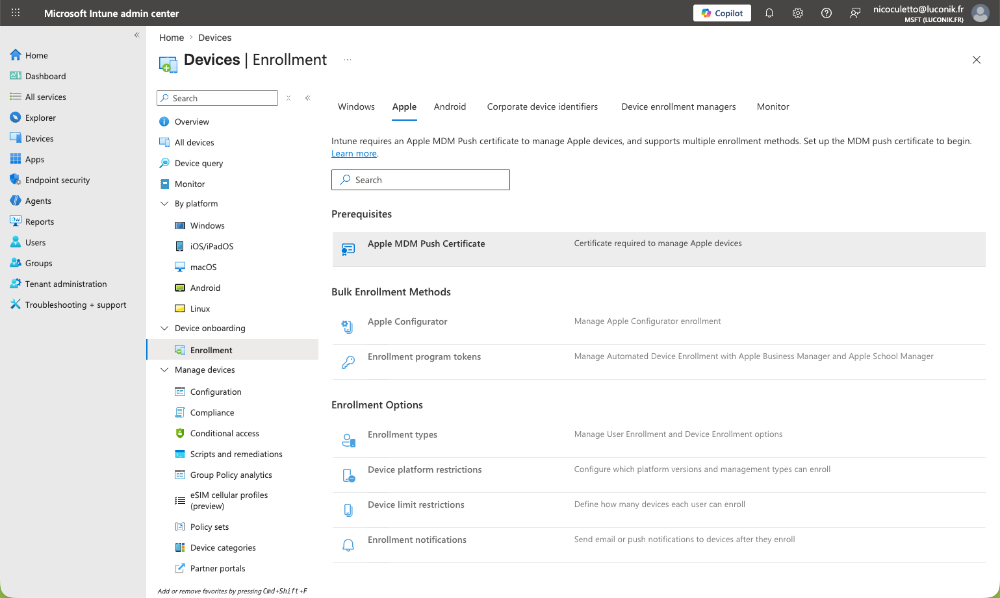
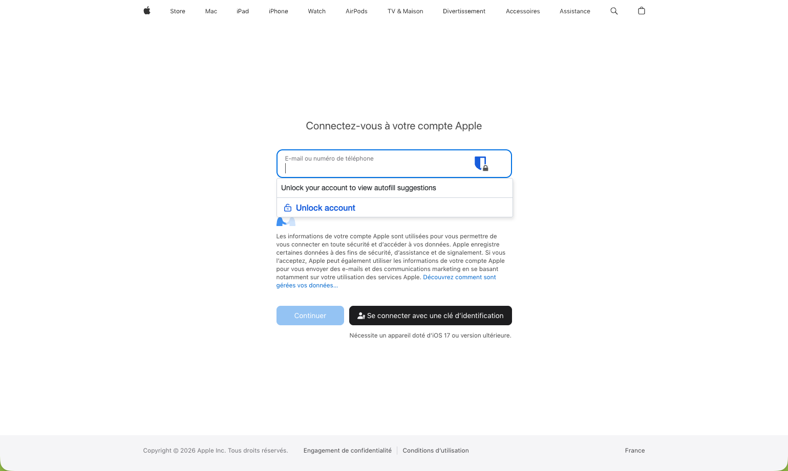
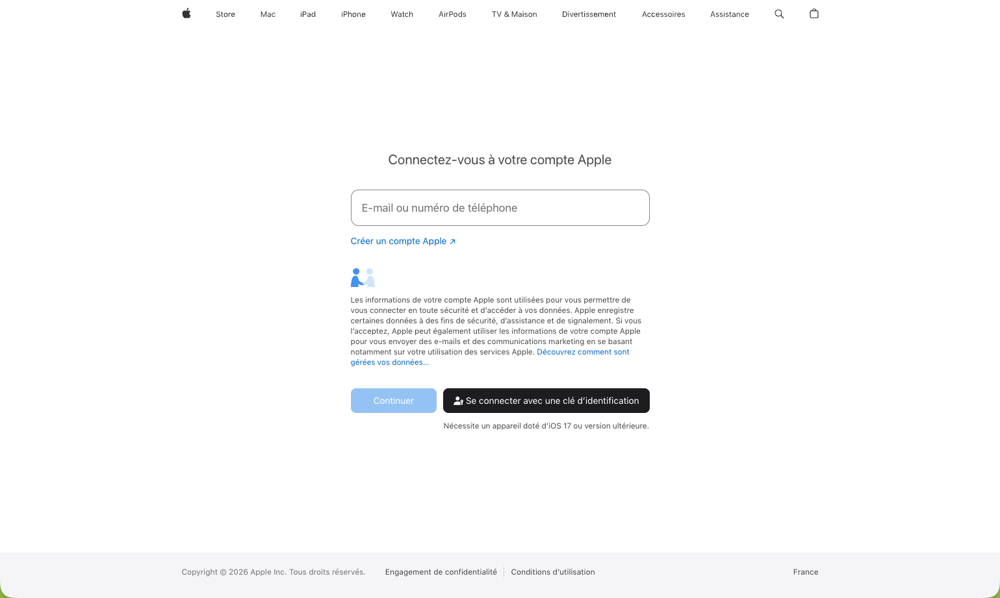
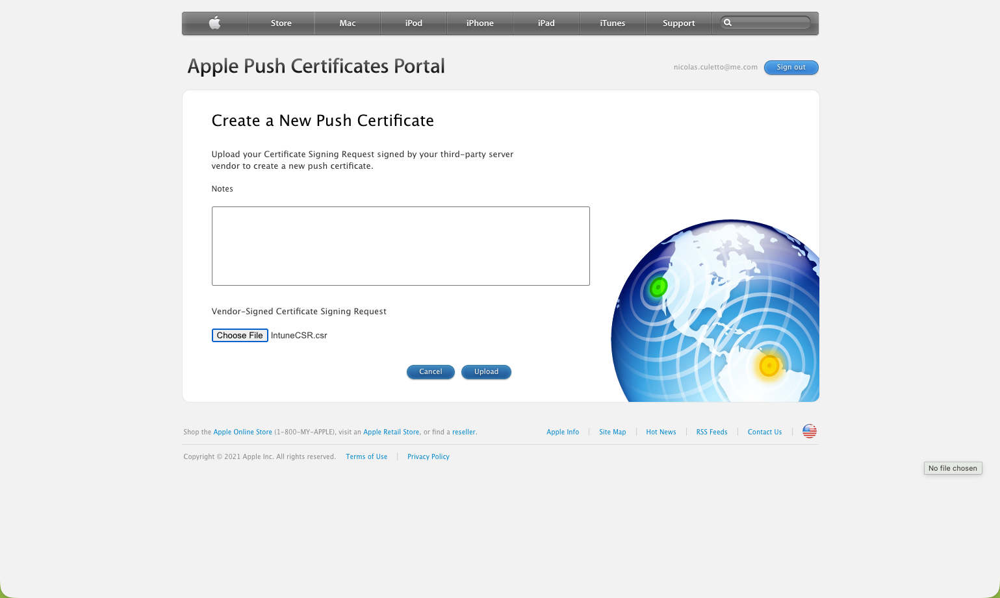
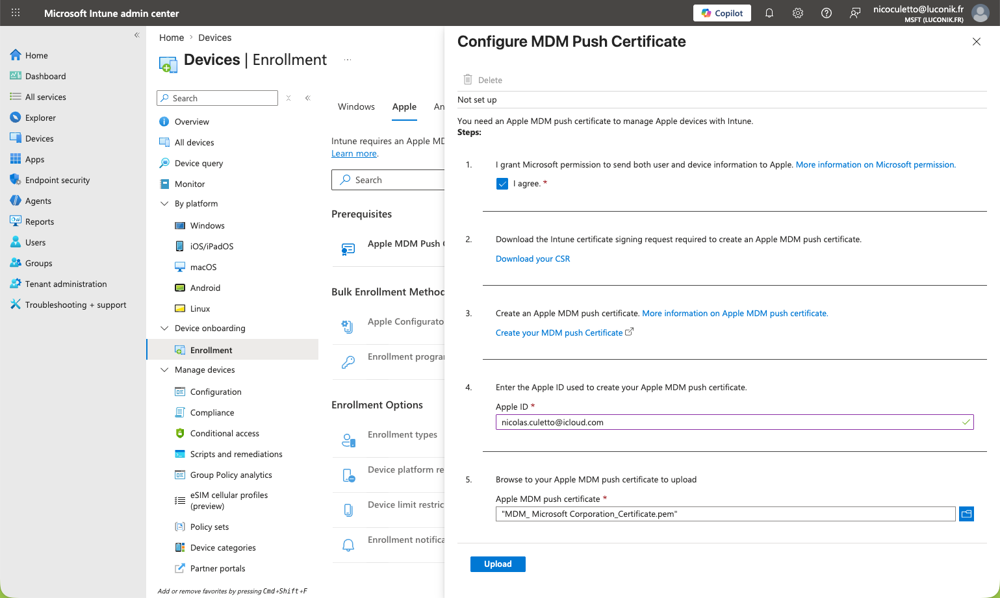

# EAP-TLS Prerequisites — Microsoft Entra ID + Apple APNs

> 🇫🇷 [Français](README-fr.md) | 🇬🇧 English


---

## Table of contents

- [Overview](#overview)
- [Part 0 — Microsoft Entra ID](#part-0--microsoft-entra-id)
  - [0.1 Add and verify a custom domain](#01-add-and-verify-a-custom-domain)
  - [0.2 Verify Intune CNAME DNS records](#02-verify-intune-cname-dns-records)
  - [0.3 Create an App Registration](#03-create-an-app-registration)
  - [0.4 Create a Client Secret](#04-create-a-client-secret)
  - [0.5 Add API permissions](#05-add-api-permissions)
- [Part 1 — Apple MDM Push Certificate (APNs)](#part-1--apple-mdm-push-certificate-apns)
  - [1.1 Open Apple enrollment in Intune](#11-open-apple-enrollment-in-intune)
  - [1.2 Download the CSR](#12-download-the-csr)
  - [1.3 Sign in to Apple Push Certificates Portal](#13-sign-in-to-apple-push-certificates-portal)
  - [1.4 Create a new Push Certificate](#14-create-a-new-push-certificate)
  - [1.5 Upload the CSR and download the certificate](#15-upload-the-csr-and-download-the-certificate)
  - [1.6 Upload the certificate to Intune](#16-upload-the-certificate-to-intune)
- [Next steps](#next-steps)

---

## Overview

This guide covers the two one-time prerequisites required before deploying EAP-TLS profiles with Microsoft Intune:

| Prerequisite | Required for |
|---|---|
| Microsoft Entra ID App Registration | All platforms — needed for Aruba Central NAC OAuth2 identity store |
| Apple MDM Push Certificate (APNs) | macOS and iOS/iPadOS only |

> [!NOTE]
> These steps are performed once per tenant. If your Entra ID App Registration and APNs certificate are already configured, skip directly to the platform guides.

---

## Part 0 — Microsoft Entra ID

### 0.1 Add and verify a custom domain

Navigate to:
```
Entra ID → Custom domains → + Add custom domain
```

<p align="center"></p>

Add the TXT verification record to your DNS registrar.

<p align="center"></p>

<p align="center"></p>

<p align="center"></p>

<p align="center"></p>

Return to Entra ID and click **Verify**.

<p align="center"></p>

---

### 0.2 Verify Intune CNAME DNS records

Required for automatic device enrollment in Intune.

<p align="center"></p>

---

### 0.3 Create an App Registration

Navigate to:
```
Entra ID → App registrations → + New registration
```

<p align="center"></p>

Configure the redirect URI.

<p align="center"></p>

> [!NOTE]
> Keep the **Application (client) ID** and **Directory (tenant) ID** — they are required when configuring the Aruba Central Intune extension and the NAC OAuth identity store.

---

### 0.4 Create a Client Secret

Navigate to:
```
Application → Certificates & secrets → + New client secret
```

<p align="center"></p>

> [!WARNING]
> Copy the **value** immediately — it won't be shown again after you leave this page.

<p align="center"></p>

<p align="center"></p>

---

### 0.5 Add API permissions

Navigate to:
```
Application → API permissions → + Add permission → Microsoft Graph → Intune
```

<p align="center"></p>

<p align="center"></p>

---

## Part 1 — Apple MDM Push Certificate (APNs)

> [!IMPORTANT]
> Required for macOS and iOS/iPadOS only. Skip if you are deploying to Windows endpoints only.
> This is a one-time setup per tenant — the same certificate covers both macOS and iOS/iPadOS.

### 1.1 Open Apple enrollment in Intune

Navigate to:
```
Intune Admin Center → Devices → Enrollment → Apple tab
```

<p align="center"></p>

Click **Apple MDM Push Certificate**.

---

### 1.2 Download the CSR

Check **I agree** to grant Microsoft permission to send data to Apple, then click **Download your CSR**.

<p align="center"></p>

---

### 1.3 Sign in to Apple Push Certificates Portal

Go to [https://identity.apple.com](https://identity.apple.com) and sign in with a **corporate Apple ID**.

<p align="center"></p>

> [!WARNING]
> Use a shared corporate Apple ID, not a personal one. The certificate renewal will require the same Apple ID each year.

---

### 1.4 Create a new Push Certificate

Click **Create a Certificate**, then accept the Terms of Use.

<p align="center"></p>

<p align="center"></p>

<p align="center"></p>

---

### 1.5 Upload the CSR and download the certificate

Upload the `IntuneCSR.csr` file downloaded in step 1.2, then click **Upload**.

<p align="center"></p>

Download the generated `.pem` certificate.

<p align="center"></p>

---

### 1.6 Upload the certificate to Intune

Back in Intune, enter the Apple ID used, upload the `.pem` file, then click **Upload**.

<p align="center"></p>

The certificate is now configured and active.

<p align="center"></p>

---

## Next steps

Once prerequisites are configured, proceed to the platform guides:

| Platform | Guide |
|---|---|
| Windows | [../windows/README.md](../windows/README.md) |
| macOS | [../macos/README.md](../macos/README.md) |
| iOS/iPadOS | [../ios/README.md](../ios/README.md) |

For the Aruba Central NAC configuration (identity store, roles, authorization policies, SSID), see:

→ [hpe-aruba-guides / central-nac-intune](https://github.com/Luconik/hpe-aruba-guides/tree/main/central-nac-intune)

---

## File structure

```
eap-tls/prerequisites/
├── README.md               ← This file (EN)
├── README-fr.md            ← French version
└── screenshots/
    ├── 01-entra-id-custom-domain-add.png
    ├── ...
    ├── 14-entra-id-api-permissions-graph-intune.png
    ├── 71-intune-apns-enrollment-apple-tab.png
    ├── ...
    └── 80-intune-apns-configure-mdm-push-configured.png
```

---

*Last updated: May 2026 — [@Luconik](https://github.com/Luconik)*
