# Prérequis EAP-TLS — Microsoft Entra ID + Apple APNs

> 🇫🇷 Français | 🇬🇧 [English](README.md)


---

## Table des matières

- [Présentation](#présentation)
- [Partie 0 — Microsoft Entra ID](#partie-0--microsoft-entra-id)
  - [0.1 Ajouter et vérifier un domaine personnalisé](#01-ajouter-et-vérifier-un-domaine-personnalisé)
  - [0.2 Vérifier les enregistrements DNS CNAME pour Intune](#02-vérifier-les-enregistrements-dns-cname-pour-intune)
  - [0.3 Créer une App Registration](#03-créer-une-app-registration)
  - [0.4 Créer un Client Secret](#04-créer-un-client-secret)
  - [0.5 Ajouter les permissions API](#05-ajouter-les-permissions-api)
- [Partie 1 — Certificat Apple MDM Push (APNs)](#partie-1--certificat-apple-mdm-push-apns)
  - [1.1 Ouvrir l'enrollment Apple dans Intune](#11-ouvrir-lenrollment-apple-dans-intune)
  - [1.2 Télécharger le CSR](#12-télécharger-le-csr)
  - [1.3 Se connecter au portail Apple Push Certificates](#13-se-connecter-au-portail-apple-push-certificates)
  - [1.4 Créer un nouveau certificat Push](#14-créer-un-nouveau-certificat-push)
  - [1.5 Uploader le CSR et télécharger le certificat](#15-uploader-le-csr-et-télécharger-le-certificat)
  - [1.6 Uploader le certificat dans Intune](#16-uploader-le-certificat-dans-intune)
- [Étapes suivantes](#étapes-suivantes)

---

## Présentation

Ce guide couvre les deux prérequis uniques à configurer avant de déployer les profils EAP-TLS avec Microsoft Intune :

| Prérequis | Requis pour |
|---|---|
| App Registration Microsoft Entra ID | Toutes les plateformes — nécessaire pour l'identity store OAuth2 d'Aruba Central NAC |
| Certificat Apple MDM Push (APNs) | macOS et iOS/iPadOS uniquement |

> [!NOTE]
> Ces étapes sont effectuées une seule fois par tenant. Si l'App Registration Entra ID et le certificat APNs sont déjà configurés, aller directement aux guides de plateforme.

---

## Partie 0 — Microsoft Entra ID

### 0.1 Ajouter et vérifier un domaine personnalisé

Naviguer vers :
```
Entra ID → Domaines personnalisés → + Ajouter un domaine personnalisé
```

<p align="center"></p>

Ajouter l'enregistrement TXT de vérification chez le registrar DNS.

<p align="center">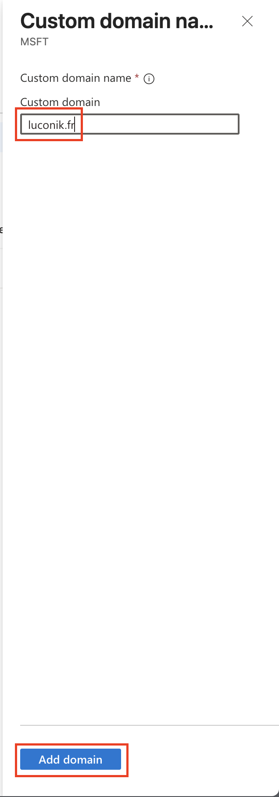</p>

<p align="center">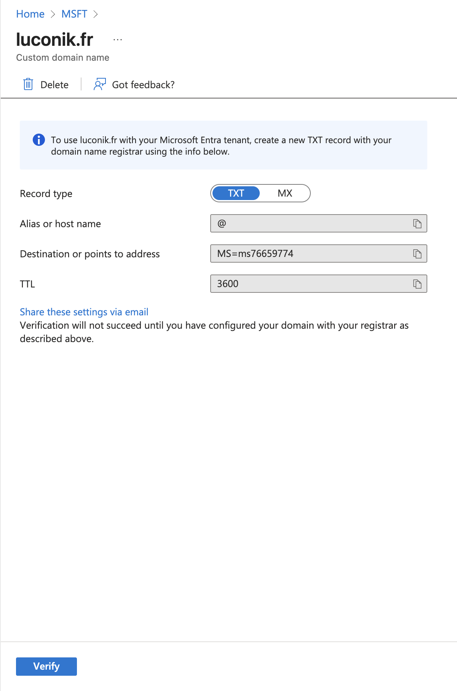</p>

<p align="center"></p>

<p align="center">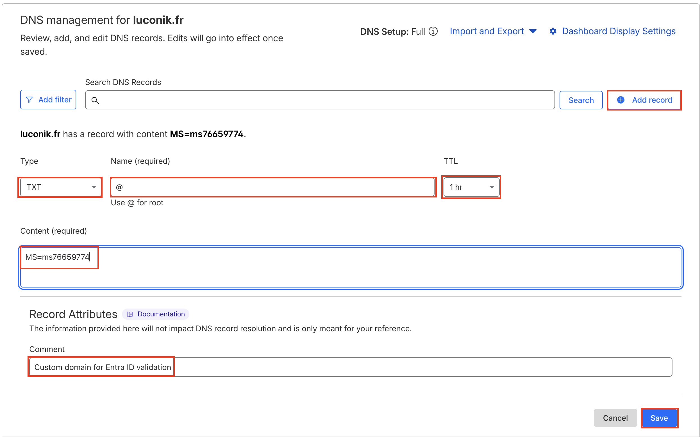</p>

Retourner dans Entra ID et cliquer **Vérifier**.

<p align="center">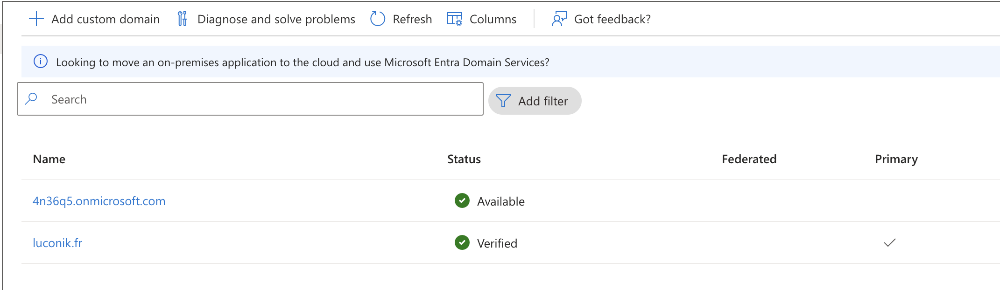</p>

---

### 0.2 Vérifier les enregistrements DNS CNAME pour Intune

Requis pour l'enrôlement automatique des appareils dans Intune.

<p align="center"></p>

---

### 0.3 Créer une App Registration

Naviguer vers :
```
Entra ID → Inscriptions d'applications → + Nouvelle inscription
```

<p align="center"></p>

Configurer l'URI de redirection.

<p align="center">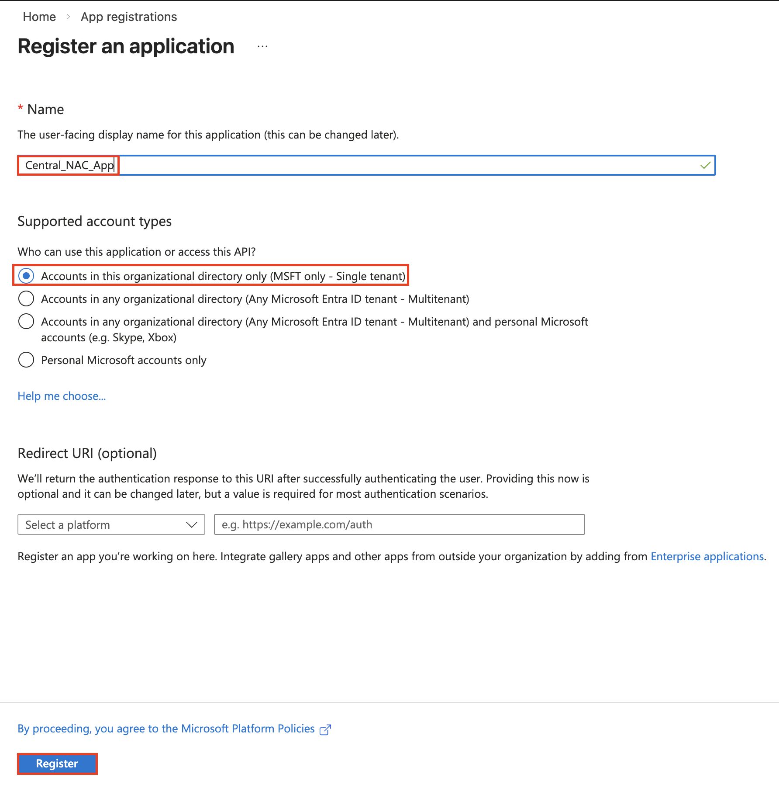</p>

> [!NOTE]
> Conserver l'**ID d'application (client)** et l'**ID de l'annuaire (tenant)** — ils sont requis lors de la configuration de l'extension Intune dans Aruba Central et de l'identity store OAuth NAC.

---

### 0.4 Créer un Client Secret

Naviguer vers :
```
Application → Certificats et secrets → + Nouveau secret client
```

<p align="center">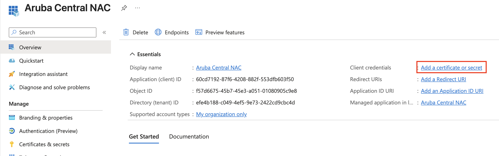</p>

> [!WARNING]
> Copier la **valeur** du secret immédiatement — elle ne sera plus visible après fermeture de cette page.

<p align="center">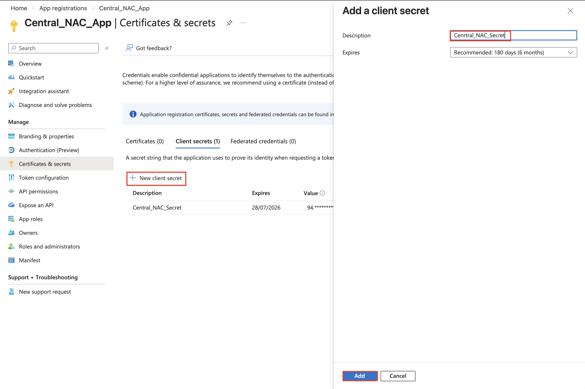</p>

<p align="center">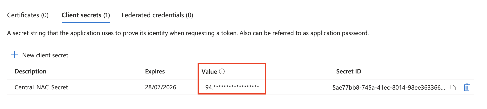</p>

---

### 0.5 Ajouter les permissions API

Naviguer vers :
```
Application → Autorisations API → + Ajouter une autorisation → Microsoft Graph → Intune
```

<p align="center">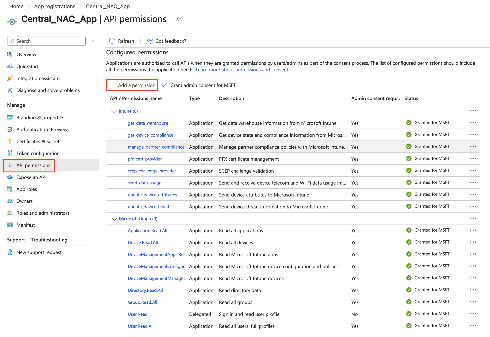</p>

<p align="center">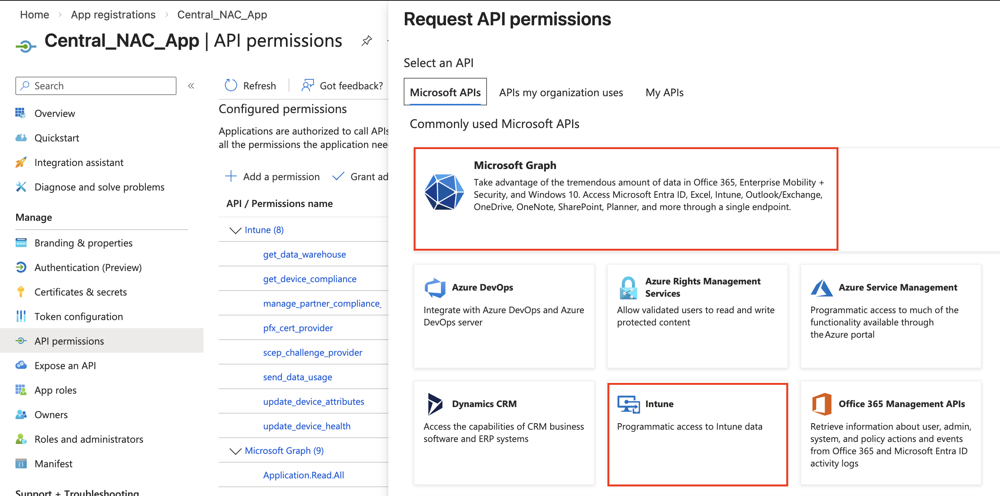</p>

---

## Partie 1 — Certificat Apple MDM Push (APNs)

> [!IMPORTANT]
> Requis pour macOS et iOS/iPadOS uniquement. À ignorer si le déploiement concerne uniquement des postes Windows.
> C'est une configuration unique par tenant — le même certificat couvre macOS et iOS/iPadOS.

### 1.1 Ouvrir l'enrollment Apple dans Intune

Naviguer vers :
```
Intune Admin Center → Appareils → Enrollment → Onglet Apple
```

<p align="center"></p>

Cliquer sur **Apple MDM Push Certificate**.

---

### 1.2 Télécharger le CSR

Cocher **I agree** pour autoriser Microsoft à envoyer des données à Apple, puis cliquer sur **Download your CSR**.

<p align="center"></p>

---

### 1.3 Se connecter au portail Apple Push Certificates

Aller sur [https://identity.apple.com](https://identity.apple.com) et se connecter avec un **Apple ID d'entreprise**.

<p align="center"></p>

> [!WARNING]
> Utiliser un Apple ID d'entreprise partagé, pas un Apple ID personnel. Le renouvellement annuel du certificat nécessitera le même Apple ID.

---

### 1.4 Créer un nouveau certificat Push

Cliquer sur **Create a Certificate**, puis accepter les Conditions d'utilisation.

<p align="center">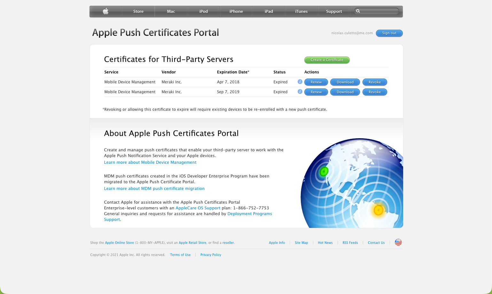</p>

<p align="center">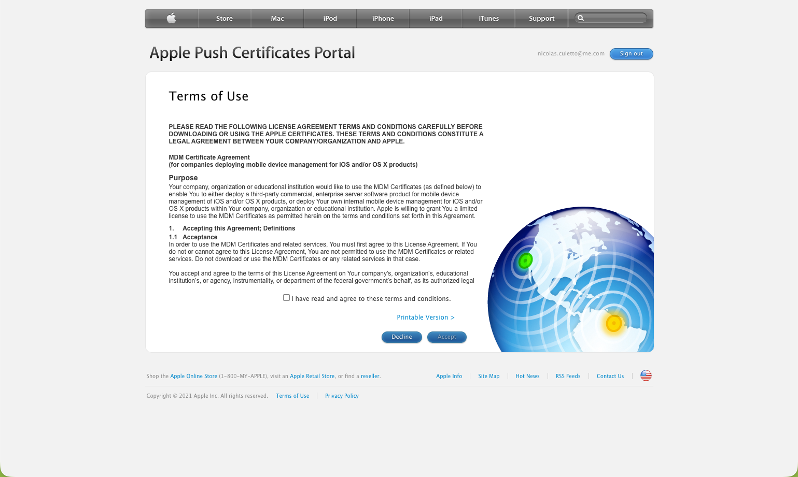</p>

<p align="center"></p>

---

### 1.5 Uploader le CSR et télécharger le certificat

Uploader le fichier `IntuneCSR.csr` téléchargé à l'étape 1.2, puis cliquer sur **Upload**.

<p align="center"></p>

Télécharger le certificat `.pem` généré.

<p align="center">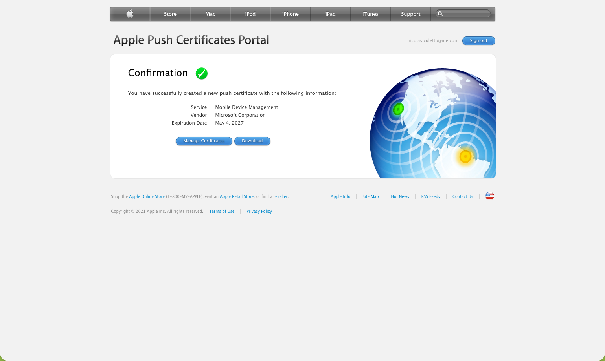</p>

---

### 1.6 Uploader le certificat dans Intune

De retour dans Intune, saisir l'Apple ID utilisé, uploader le fichier `.pem`, puis cliquer sur **Upload**.

<p align="center"></p>

Le certificat est maintenant configuré et actif.

<p align="center">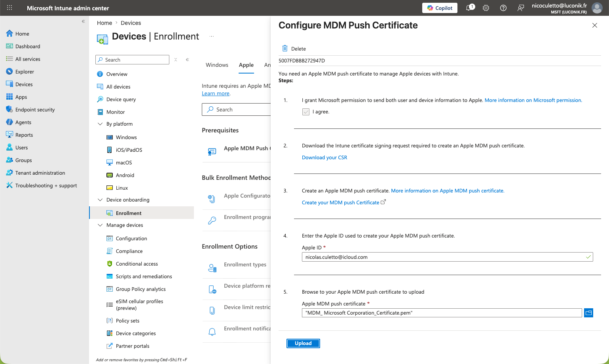</p>

---

## Étapes suivantes

Une fois les prérequis configurés, passer aux guides de plateforme :

| Plateforme | Guide |
|---|---|
| Windows | [../eap-tls/windows/README-fr.md](../eap-tls/windows/README-fr.md) |
| macOS | [../eap-tls/macos/README-fr.md](../eap-tls/macos/README-fr.md) |
| iOS/iPadOS | [../eap-tls/ios/README-fr.md](../eap-tls/ios/README-fr.md) |

Pour la configuration Aruba Central NAC (identity store, rôles, politiques d'autorisation, SSID), voir :

→ [hpe-aruba-guides / central-nac-intune](https://github.com/Luconik/hpe-aruba-guides/tree/main/central-nac-intune)

---

## Structure des fichiers

```
prerequisites/
├── README.md               ← Version anglaise
├── README-fr.md            ← Ce fichier (FR)
└── screenshots/
    ├── 01-entra-id-custom-domain-add.png
    ├── ...
    ├── 14-entra-id-api-permissions-graph-intune.png
    ├── 71-intune-apns-enrollment-apple-tab.png
    ├── ...
    └── 80-intune-apns-configure-mdm-push-configured.png
```

---

*Dernière mise à jour : Mai 2026 — [@Luconik](https://github.com/Luconik)*
